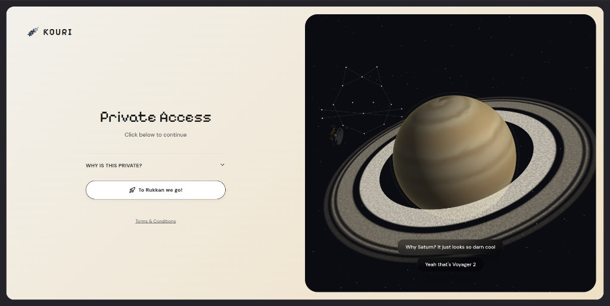
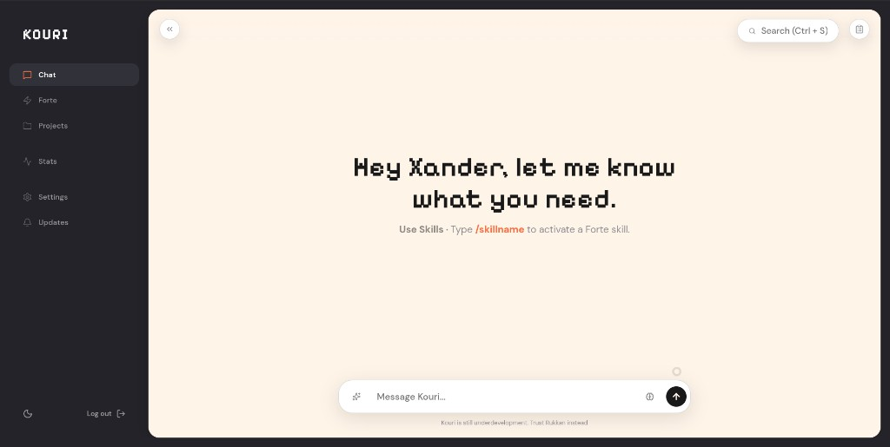
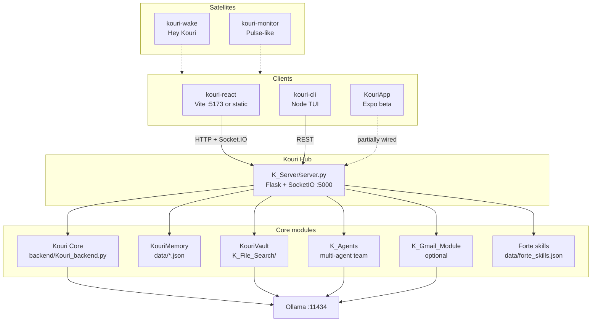

# Kouri

<p align="center">
  
</p>

<p align="center">
  <strong>Intelligence, Modularized.</strong><br />
  A privacy-first intelligence layer — multi-agent orchestration, on-device memory, and local inference via Ollama.<br />
  Less assistant. More cognitive operating system.<br />
  Built by Tadey.
</p>

<p align="center">
  <a href="https://kouri-rukkan.vercel.app/"><strong>Rukkan → Private Access</strong></a>
  ·
  <a href="https://github.com/TadeyRuk/Kouri-Public/wiki">Wiki</a>
</p>

| Private Access | Chat |
|:---:|:---:|
|  |  |

<p align="center"><em>Live Private Access surface: <a href="https://kouri-rukkan.vercel.app/">kouri-rukkan.vercel.app</a></em></p>

---

## What Kouri is

Kouri is a privacy-first intelligence layer designed to route complex tasks across specialized local models and behavioral logic. By merging multi-agent orchestration with persistent on-device memory, it evolves beyond a simple chatbot into a cognitive operating system — learning your patterns, securing your data, and integrating into daily workflows without exposing sensitive context to the cloud.

Rukkan is the private web workspace for Kouri: a personal AI environment, not a public SaaS product.

---

## Design philosophy

Kouri is built around five principles:

1. **Modular over monolithic**
2. **Local-first architecture**
3. **Behavior-driven intelligence**
4. **Task-specialized models**
5. **User sovereignty over data**

It is less "assistant" and more "cognitive operating system."

---

## Architecture

UIs stay thin. Capability lives on the Flask hub and local modules. Inference stays on-device via Ollama.



| Layer | Path | Role |
| :--- | :--- | :--- |
| **Hub** | `K_Server/server.py` | Routes, SocketIO streaming, static React build, wires modules |
| **Core** | `backend/Kouri_backend.py` | Prompts, dual memory, Ollama generate/stream |
| **Vault** | `K_File_Search/` | Folder-scoped RAG (FAISS + embeddings) |
| **Agents** | `K_Agents/` | Orchestrator / researcher / strategist / evaluator |
| **Mail** | `K_Gmail_Module/` | Optional Gmail read/summarize |
| **Web** | `kouri-react/` | Primary UI |
| **TUI** | `kouri-cli/` | Terminal UI |
| **Mobile** | `KouriApp/` | Expo shell (beta) |
| **Wake** | `kouri-wake/` | Optional wake-word daemon |
| **Data** | `data/` | Memory, injects, settings, Forte skills |

---

## Surfaces

### Web — Intelligent interaction. Seamless execution.

`kouri-react` is the primary surface: streaming chat over Socket.IO, sessions, RAG reader, settings/memory, and Forte skills. Dev runs on `:5173` (proxied to the hub); production builds land in `K_Server/static/` and are served from `:5000`.

Live private workspace: [kouri-rukkan.vercel.app](https://kouri-rukkan.vercel.app/).

### TUI — Always in the terminal.

`kouri-cli` (Node + blessed) talks REST to the hub: dashboard menu, inline chat, and `/read` for RAG browse/index/query.

### Mobile — Always within reach. Always private.

`KouriApp` (Expo / React Native) is the mobile shell. Layout and local session UI exist; full hub wiring is still maturing — treat as beta, not the source of truth for features.

---

## Modules (in depth)

### Kouri Hub — `K_Server/`

Central API composition root. Flask + Flask-SocketIO on port `5000`.

- **Chat:** Socket.IO `message` → streamed `token` / `think_token` / `done` / `error`; also `POST /chat`
- **RAG / files:** `/rag/index`, `/rag/query`, `/files/read`
- **Agents:** `/agents/run`, `/agents/chat`, `/agents/info`
- **Email:** `/email/fetch`, `/email/summarize` (optional)
- **Settings / memory / Forte:** `/settings*`, `/forte/skills`
- **Health / remote:** `/health`, `/remote/chat`
- Serves the Vite-built React app from `static/`

**Status:** Active — the spine of the system.

### Kouri Core — `backend/Kouri_backend.py`

The reasoning brain behind chat.

- Builds prompts from persona injects, dual memory, and context classification
- Streams generation through Ollama (`/api/generate`); default model `qwen3.5:4b` (`KOURI_MODEL`)
- Dual modes: normal companion vs copilot/coding memory files
- Greeting/intro dedupe, emoji policy, task routing
- Optional Gemini path only when the selected model name starts with `gemini` (escape hatch — not the default)

**Status:** Active.

### KouriMemory — `data/`

Persistent local context — not a cloud profile store.

- `kouri_memory.json` / `kouri_memory_copilot.json` — dual conversation histories
- `injects.json` — tone, name, personality traits injected into prompts
- `kouri_settings.json` — model and client settings
- Exposed in the web UI Memory / Settings panels

**Status:** Active. Memory is local JSON (sovereignty over polish).

### KouriVault — `K_File_Search/`

Folder-scoped RAG — semantic retrieval over *your* files, not an encrypted secrets locker.

- Path whitelist (`path_guard.py`) so indexing stays inside approved roots
- Format-aware chunking (Markdown, Python AST, JSON-aware, etc.)
- Embeddings via `all-MiniLM-L6-v2`; vectors in FAISS (`IndexFlatIP`)
- Index cache under `~/.kouri/rag_index/`
- Query path retrieves chunks and answers via Ollama

**Status:** Active.

### Multi-agent team — `K_Agents/`

Message-bus coordination for harder tasks.

- `orchestrator` routes work across `researcher`, `strategist`, and `evaluator`
- Agents talk to Ollama via `/api/chat`
- Public API: `agent_team.py` → hub routes `/agents/*`

**Status:** Active.

### Forte — skills layer

Named skills stored in `data/forte_skills.json`, managed through `/forte/skills` and the web Forte view. Activate in chat with `/skillname`-style workflows.

**Status:** Active.

### Gmail satellite — `K_Gmail_Module/`

Read-only Gmail via OAuth (`gmail.readonly`). Fetch metadata through the hub; summarize with local Ollama. Cloud-adjacent by nature — optional, not part of the zero-cloud core.

**Status:** Optional / Active when credentials are present.

### kouri-wake — wake word

“Hey Kouri” daemon: Porcupine detection, edge-light socket (`/tmp/kouri_edge.sock`), chime feedback. Runs as its own process (optional systemd service); does not replace the hub.

**Status:** Optional.

### kouri-monitor — Pulse-adjacent

Host health poller (CPU, RAM, disk, temp, battery, …) with desktop notifications. Closest real implementation to marketing “KouriPulse.”

**Status:** Optional satellite.

---

### Expanding / not fully shipped

These names appear in product/marketing language. Be honest about what exists today:

| Name | Reality today |
| :--- | :--- |
| **KouriLink** | No dedicated sync module — clients use Socket.IO/REST to the hub |
| **KouriSense** | Analytics / perception concepts; scraps only (e.g. usage predictor experiments) |
| **KouriPulse** | Closest match: `kouri-monitor/` — not a full agent-swarm supervisor |
| **KouriDevTools** | Debug routes / UI stubs; not a finished IDE toolkit |
| **KouriCloud** | No sync/backup product — optional Gemini path is the only cloud LLM escape hatch |
| **KouriVision** | Unfinished — do not treat as shipped |

---

## Privacy model

- **Inference:** local Ollama by default (`qwen3.5:4b`)
- **Memory & prompts:** stay on-device
- **Telemetry:** none by design
- **Exceptions:** optional satellites (e.g. Gmail OAuth) are cloud-adjacent and not part of the zero-cloud core

---

## Quick start

Prerequisites: Python 3.10+, Node.js 18+, and [Ollama](https://ollama.com) running locally.

```bash
ollama pull qwen3.5:4b
```

Clone this repository, then follow the [wiki](https://github.com/TadeyRuk/Kouri-Public/wiki) for run instructions (API on `:5000`, web UI on `:5173`).

For the live private workspace: [https://kouri-rukkan.vercel.app/](https://kouri-rukkan.vercel.app/)

---

## License

[AGPL-3.0](LICENSE)
