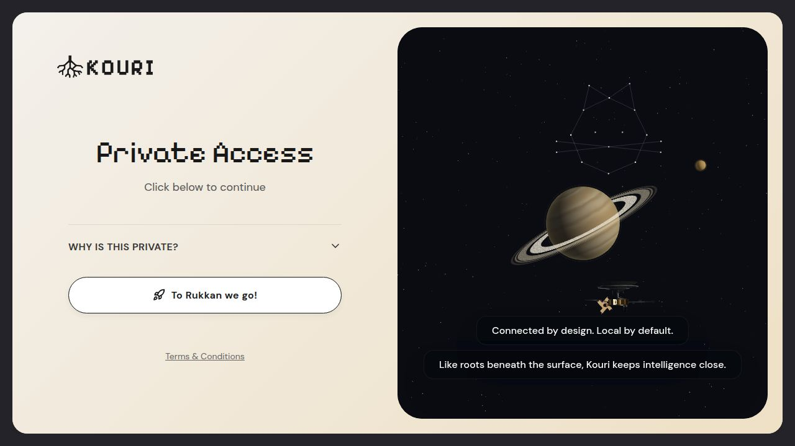
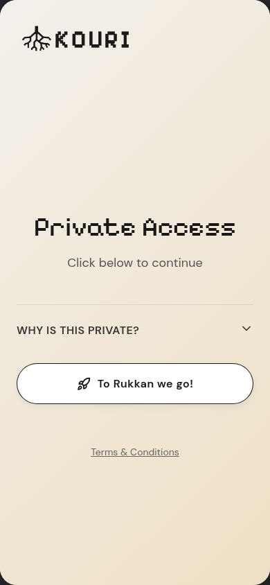
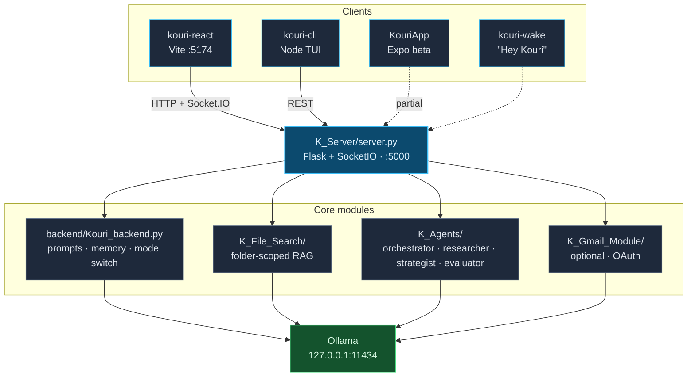
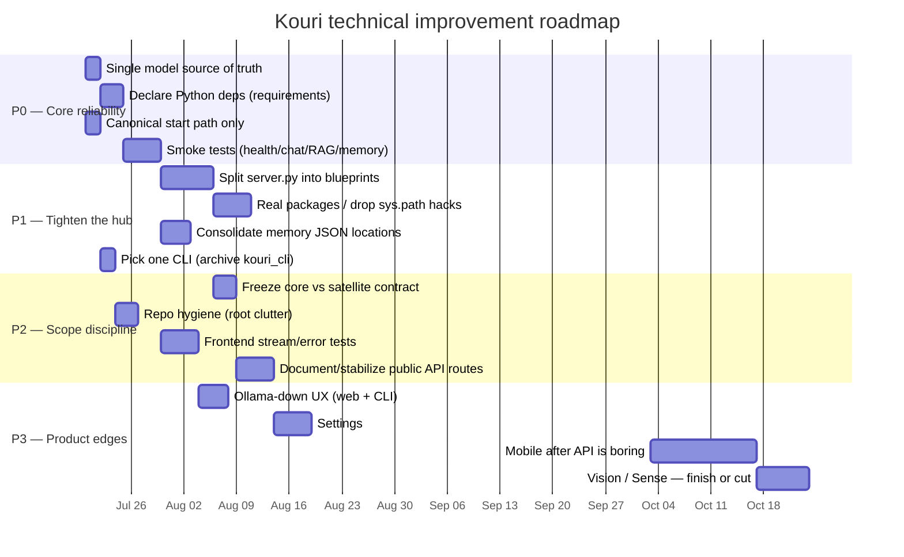

# Kouri

<p align="center">
  
</p>

<p align="center">
  <strong>Privacy-first, on-device AI companion.</strong><br />
  Local inference via Ollama (<code>qwen3.5:4b</code>). Built by Tadey.
</p>

| Desktop | Mobile |
|:---:|:---:|
|  |  |

---

## What this is

Kouri is a local AI companion: chat, memory, folder-scoped RAG, optional Gmail, and a multi-agent path — all through a Flask API that frontends talk to. Inference stays on-device via Ollama. No cloud LLM calls.

This README is the **technical source of truth**: how the system is shaped today, how to run it, and what to improve next.

---

## Architecture



| Layer | Path | Role |
| :--- | :--- | :--- |
| **API hub** | `K_Server/server.py` | Routes, SocketIO streaming, static React build, wires modules |
| **Brain** | `backend/Kouri_backend.py` | Prompts, memory, Ollama generate/stream, mode switch |
| **RAG** | `K_File_Search/` | Folder-scoped index/query, path whitelist, FAISS + embeddings |
| **Agents** | `K_Agents/` | Orchestrator / researcher / strategist / evaluator |
| **Mail** | `K_Gmail_Module/` | Optional Gmail read/summarize (OAuth) |
| **Web** | `kouri-react/` | Primary UI (Vite → builds into `K_Server/static/`) |
| **TUI** | `kouri-cli/` | Node + blessed terminal UI |
| **Mobile** | `KouriApp/` | Expo / React Native (beta) |
| **Wake** | `kouri-wake/` | “Hey Kouri” daemon (Porcupine) |
| **Data** | `data/` | Memory JSON, injects, prompts, settings |

**Design rule:** UIs stay thin. New capability lands as a module + API surface on `K_Server`, not as frontend-only logic.

---

## Stack (actual)

| Piece | Reality |
| :--- | :--- |
| LLM | Ollama — default `qwen3.5:4b` (`KOURI_MODEL`, `KOURI_RAG_MODEL`) |
| API | Flask + Flask-SocketIO |
| Web | React 19 + Vite + TypeScript |
| TUI | Node.js + `blessed` (`kouri-cli`) |
| RAG | Custom pipeline (`K_File_Search`), index cache under `~/.kouri/rag_index/` |
| Memory | Local JSON — normal + copilot dual files |
| License | AGPL-3.0 |

Not claimed here: FastAPI, Electron desktop app, or a finished vision product. Those are either absent or unfinished.

---

## Quick start

### Prerequisites

- Python 3.10+
- Node.js 18+
- Ollama running at `http://127.0.0.1:11434`
- Model pulled:

```bash
ollama pull qwen3.5:4b
```

### One-shot (recommended)

```bash
bash start-kouri.sh
```

Starts Flask on `:5000` and Vite on `:5174`.

> **Known bug:** `start-kouri.sh` still mentions `gemma3:4b` in the Ollama-down message. Default model in code is `qwen3.5:4b`. Fix that when touching the script.

### Manual

```bash
# Terminal 1 — API (serves React build + all endpoints)
cd K_Server && python server.py

# Terminal 2 — Web UI
cd kouri-react && npm install && npm run dev
```

- Dev UI: `http://localhost:5174` (proxies API to `:5000`)
- Production-style: `npm run build` in `kouri-react`, then open `http://localhost:5000`

### Optional entry points

```bash
# TUI
cd kouri-cli && npm install && npm link && kouri

# Wake-word daemon
cd kouri-wake && pip install -r requirements.txt && python main.py
```

There is also a simpler Python launcher in `kouri_cli/` — prefer `kouri-cli/` for the full TUI.

---

## Core capabilities (status)

| Capability | Status | Notes |
| :--- | :--- | :--- |
| Chat + SocketIO streaming | Active | `/chat`, `socket.on("message")` |
| Dual memory (normal / copilot) | Active | `data/kouri_memory*.json` |
| Prompt injects / persona | Active | `data/injects.json`, `data/kouri_prompts.json` |
| Folder-scoped RAG | Active | `/rag/index`, `/rag/query`, path guard |
| Multi-agent team | Active | `/agents/*` |
| Gmail fetch / summarize | Active (optional) | Needs local OAuth creds; cloud-adjacent |
| Web UI | Active | Primary surface |
| TUI | Active | Second surface |
| Mobile app | Beta | Not the source of truth for features yet |
| Wake word | Optional | Separate daemon |
| Vision / Sense / Predictor | Incomplete / experimental | Do not treat as shipped |

---

## Privacy model

- **Inference:** local Ollama only for the core companion loop.
- **Memory / prompts:** local JSON under `data/` (and some legacy copies elsewhere — see debt).
- **Telemetry:** none by design.
- **Exception:** Gmail uses Google OAuth when enabled. Treat mail as an optional satellite, not part of the zero-cloud core.

---

## Technical improvement backlog

Work top-down. Architecture direction is fine; execution and boundaries need tightening.

### Roadmap (Gantt)

Relative timeline from “now.” Adjust dates when you actually schedule the work.



### P0 — Make the core reliable

1. **Single model source of truth** — align `start-kouri.sh`, README, and `KOURI_MODEL` default (`qwen3.5:4b`).
2. **Declare Python deps** — add `requirements.txt` or `pyproject.toml` for `K_Server` + backend (+ optional extras for RAG/Gmail). Today only `kouri-wake` / `kouri-monitor` ship requirements files.
3. **One start path** — document and keep `start-kouri.sh` + `K_Server/server.py` as canonical; stop implying `backend/Kouri_backend.py` is the server.
4. **Smoke tests** — `/health`, chat happy path, RAG index/query, memory mode switch. Wire into a minimal CI later.

### P1 — Tighten the hub

5. **Split `server.py`** — route blueprints / service layer: `chat`, `rag`, `agents`, `email`, `settings`, `remote`. Keep `server.py` as composition root only.
6. **Real packages, not `sys.path` hacks** — installable local packages or a single `PYTHONPATH` convention from the root.
7. **One memory location** — consolidate root / `K_Server` / `data` memory JSON so reads and writes cannot diverge.
8. **Pick one CLI** — keep `kouri-cli`, archive or clearly demote `kouri_cli`.

### P2 — Scope discipline

9. **Freeze the core contract** before growing satellites:
   - Core = chat + memory + streaming + settings
   - Vault = RAG
   - One primary UI = `kouri-react`
   - Satellites = agents, Gmail, wake, mobile
10. **Repo hygiene** — move scratch/personal files out of root; keep the tree looking like a product, not a desk.
11. **Frontend tests** — cover send / stream / Ollama-down error path in `kouri-react`.
12. **API stability** — version or document public routes the UIs depend on so mobile/TUI do not break silently.

### P3 — Product-quality edges (later)

13. Consistent Ollama-down UX across web + CLI.
14. Clear settings for model, backend URL, RAG roots.
15. Mobile only after core API is boring and stable.
16. Vision / Sense / usage predictor — finish or cut from the mental model until real.

### What not to do yet

- Rewrite Flask → FastAPI “for modernity”
- Add Electron before the web UI + API contract are solid
- Grow more frontends before the hub is thin and tested
- Market unfinished modules as Active

---

## Useful commands

```bash
# Backend unit smoke
cd K_Server && python unit_test.py

# RAG tests
python -m pytest tests/test_folder_scoped_rag.py

# Web
cd kouri-react && npm run lint && npm run test && npm run build
```

Env knobs (server):

| Variable | Default | Purpose |
| :--- | :--- | :--- |
| `KOURI_MODEL` | `qwen3.5:4b` | Main chat model |
| `KOURI_RAG_MODEL` | `qwen3.5:4b` | RAG generation model |
| `OLLAMA_HOST` | `http://127.0.0.1:11434` | Ollama base URL |
| `FLASK_PORT` | `5000` | API port |
| `VITE_KOURI_BACKEND_URL` | (dev proxy) | Point Vite at the API |

---

## License

[AGPL-3.0](LICENSE)
